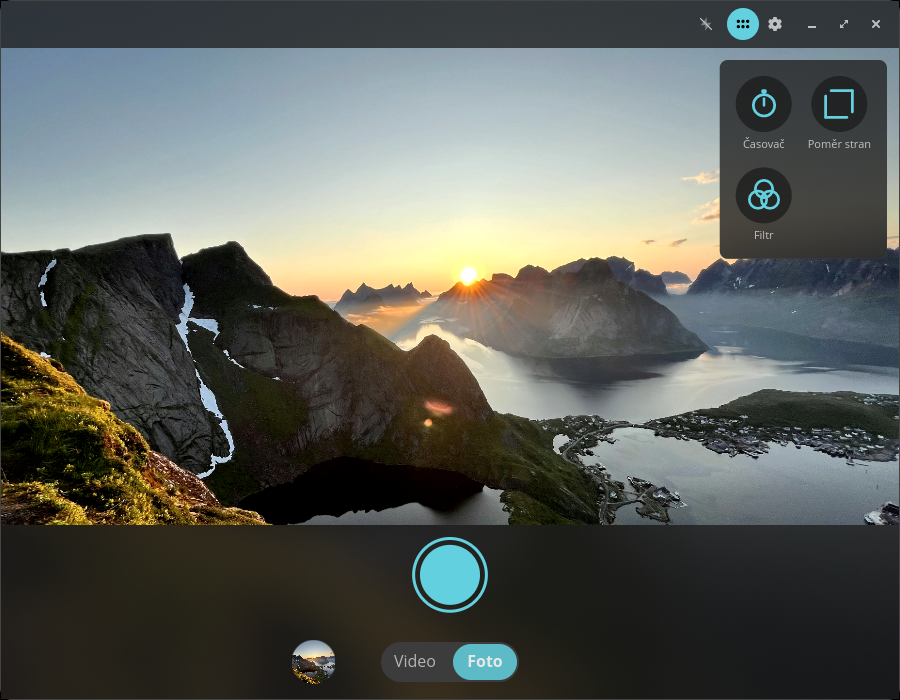
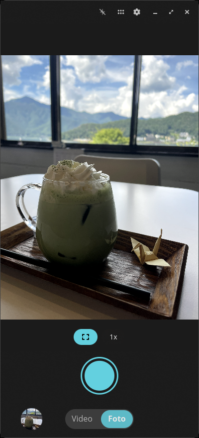
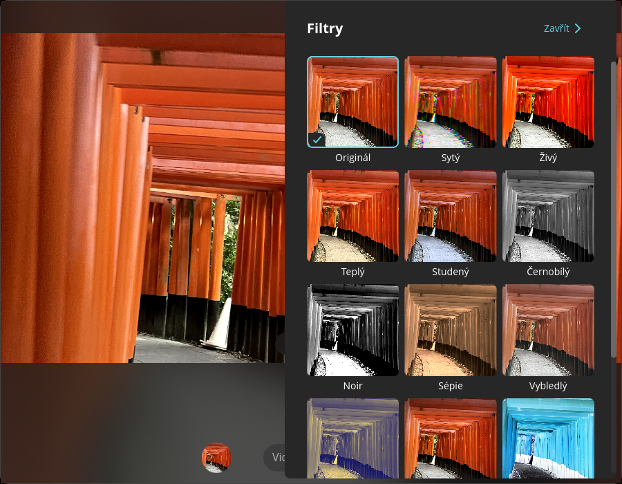
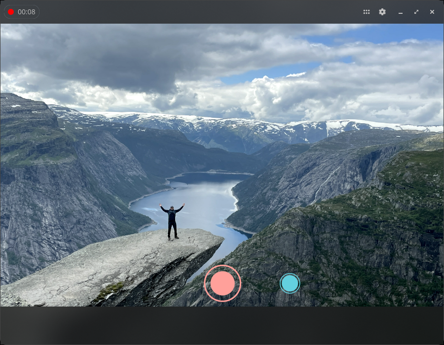
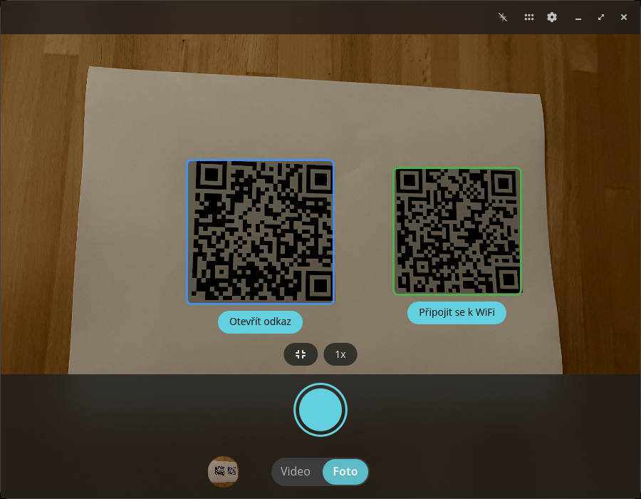
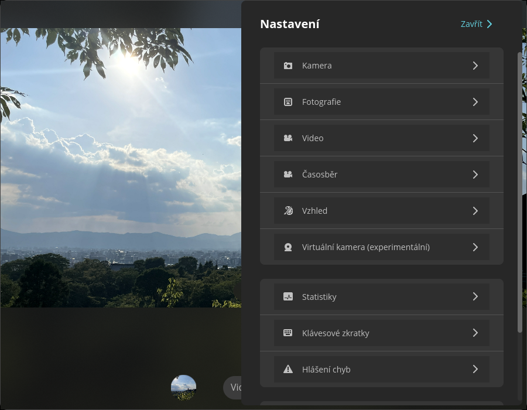

<!-- Generated by scripts/gen-metadata.py. Edit the captions in i18n/cs/camera.ftl and run `just generate`. -->

# Kamera (cs)

*Pořizujte fotografie a videa.*

|  |  |
| :---: | :---: |
|  **Režim fotografie s nabídkou nástrojů** |  **Režim fotografie na telefonu s Linuxem** |
|  **Výběr filtrů** |  **Probíhající natáčení videa** |
|  **Detekce QR kódu** |  **Pokročilá nastavení** |

---

[All languages](../../README.md#languages) ·
[en screenshots, including every theme and overlay effect](../../README.md)
