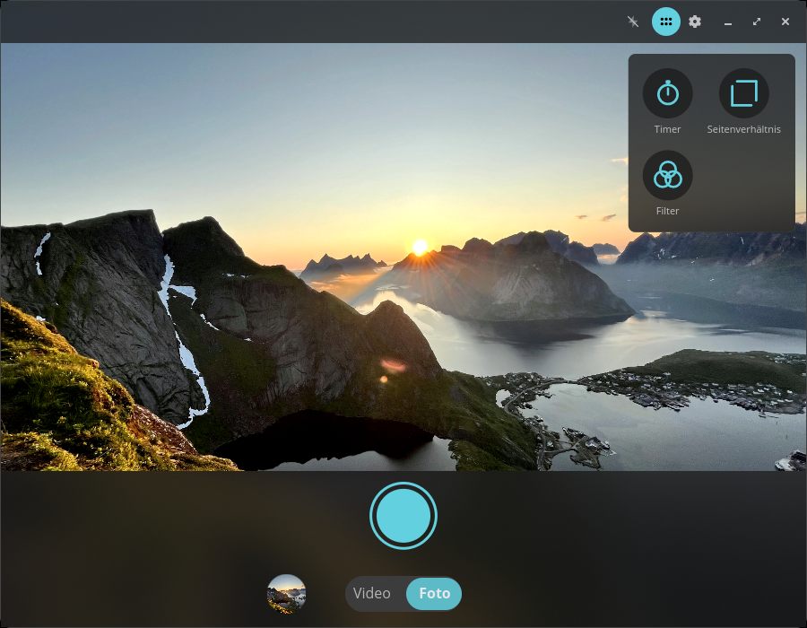
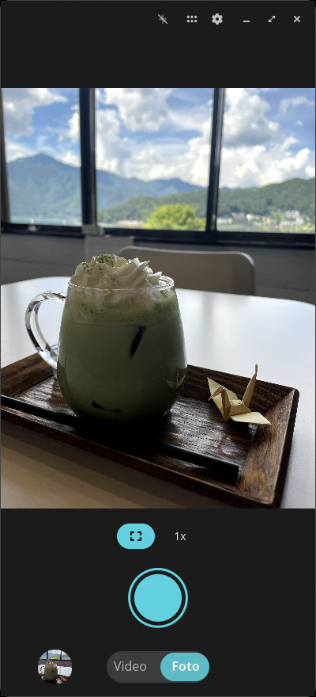
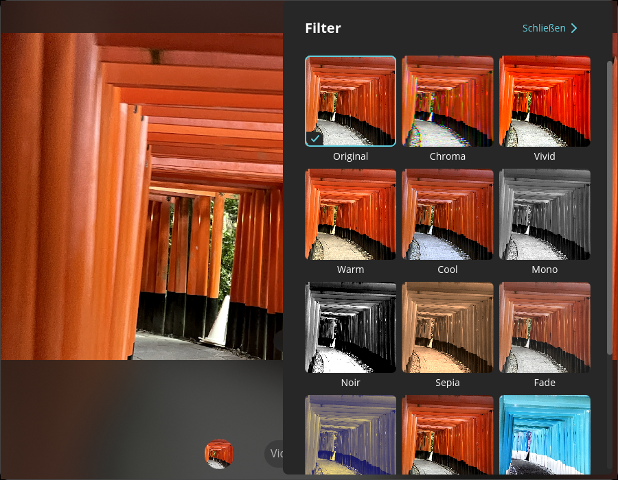
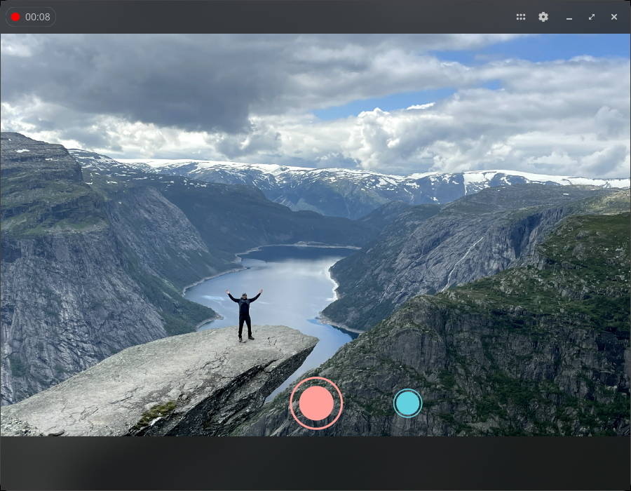
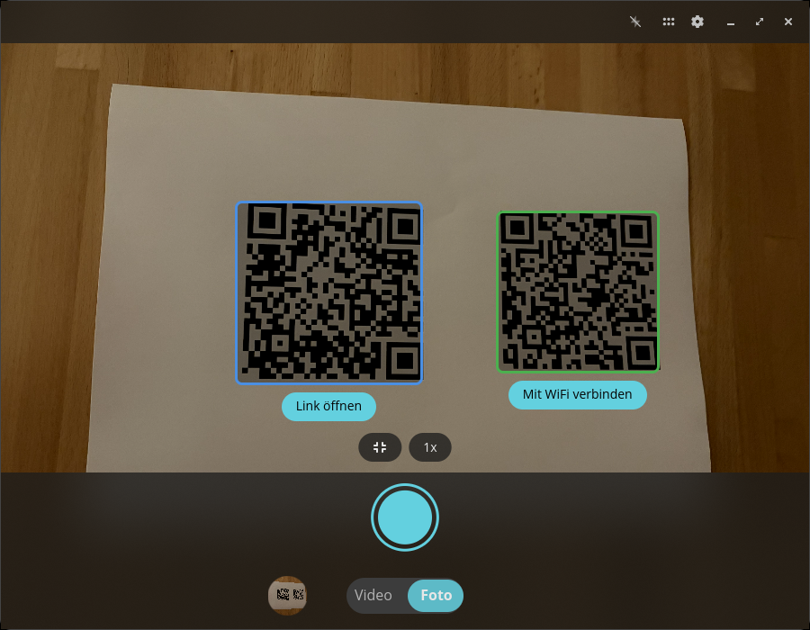
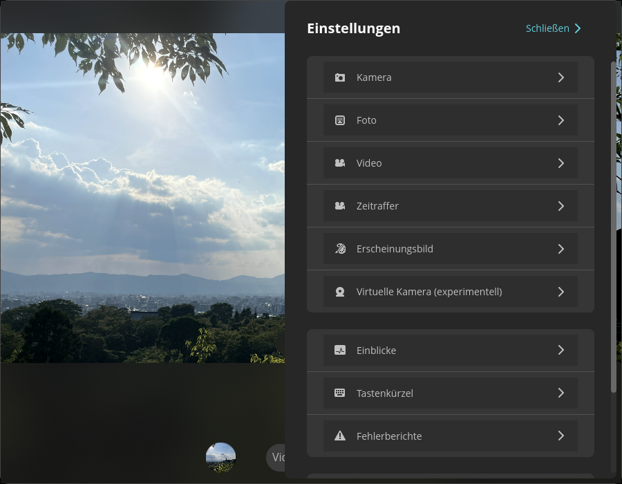

<!-- Generated by scripts/gen-metadata.py. Edit the captions in i18n/de/camera.ftl and run `just generate`. -->

# Kamera (de)

*Fotos und Videos aufnehmen.*

|  |  |
| :---: | :---: |
|  **Fotomodus mit Werkzeugmenü** |  **Fotomodus auf einem Linux-Smartphone** |
|  **Filterauswahl** |  **Laufende Videoaufnahme** |
|  **QR-Code-Erkennung** |  **Erweiterte Einstellungen** |

---

[All languages](../../README.md#languages) ·
[en screenshots, including every theme and overlay effect](../../README.md)
