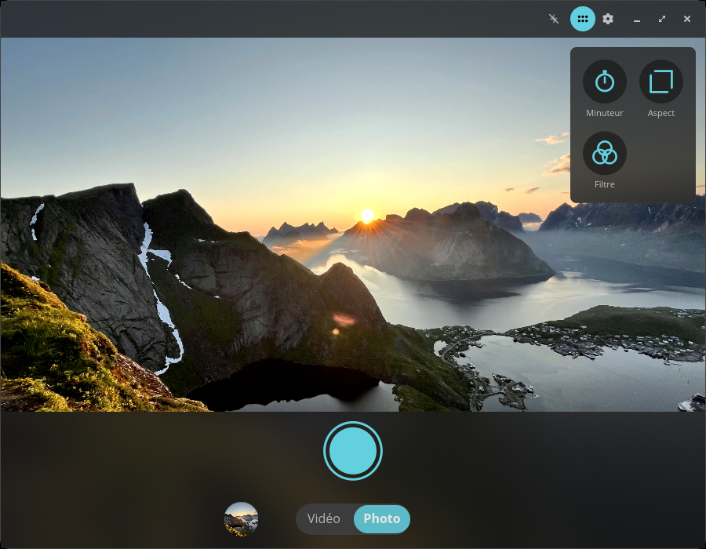
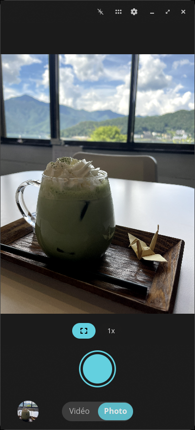
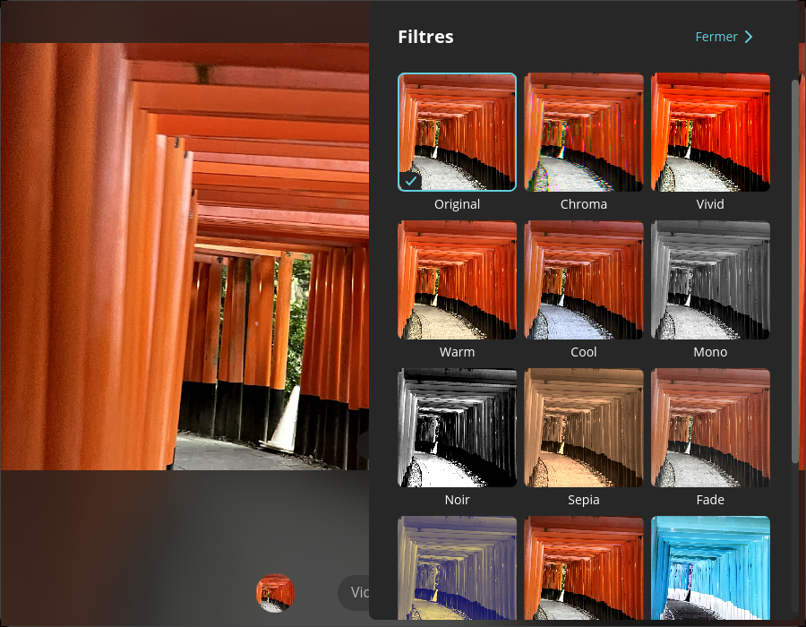
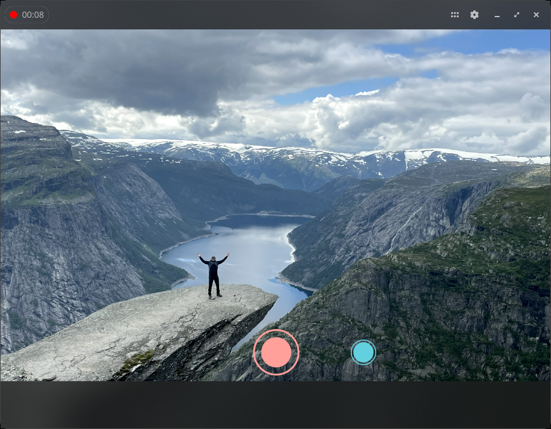
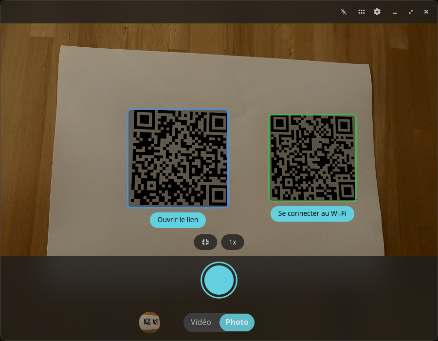
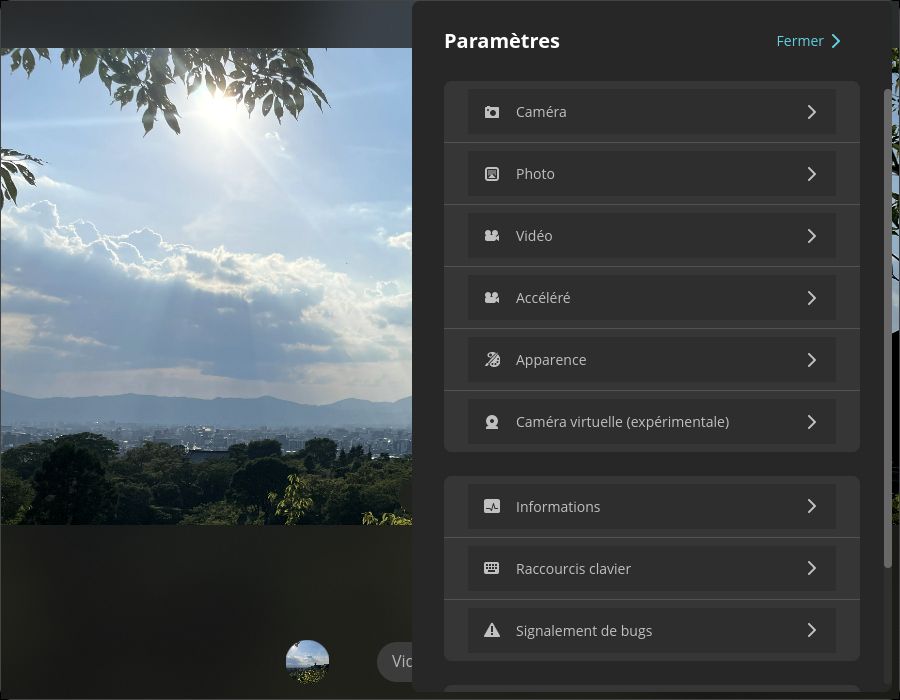

<!-- Generated by scripts/gen-metadata.py. Edit the captions in i18n/fr/camera.ftl and run `just generate`. -->

# Caméra (fr)

*Capture photos and videos.*

|  |  |
| :---: | :---: |
|  **Photo mode with tools menu** |  **Photo mode on a Linux phone** |
|  **Filter picker** |  **Video recording in progress** |
|  **QR code detection** |  **Advanced settings** |

> 6 of 6 captions are not translated into `fr` yet
> and are shown in English. Translations are welcome in
> [`i18n/fr/camera.ftl`](../../../i18n/fr/camera.ftl).

---

[All languages](../../README.md#languages) ·
[en screenshots, including every theme and overlay effect](../../README.md)
