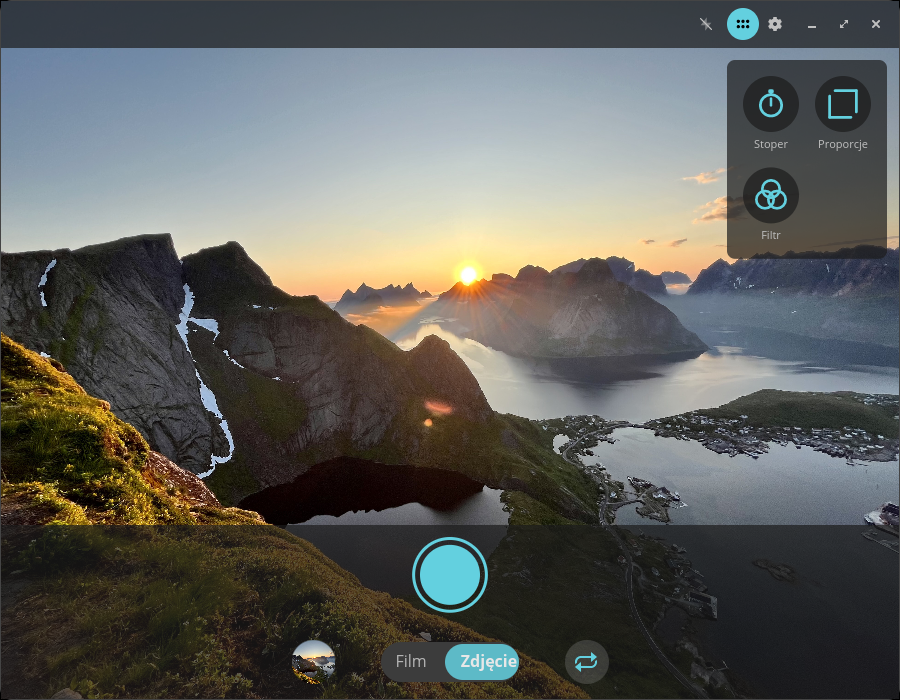
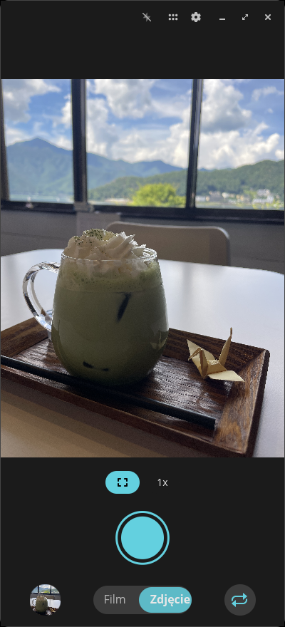
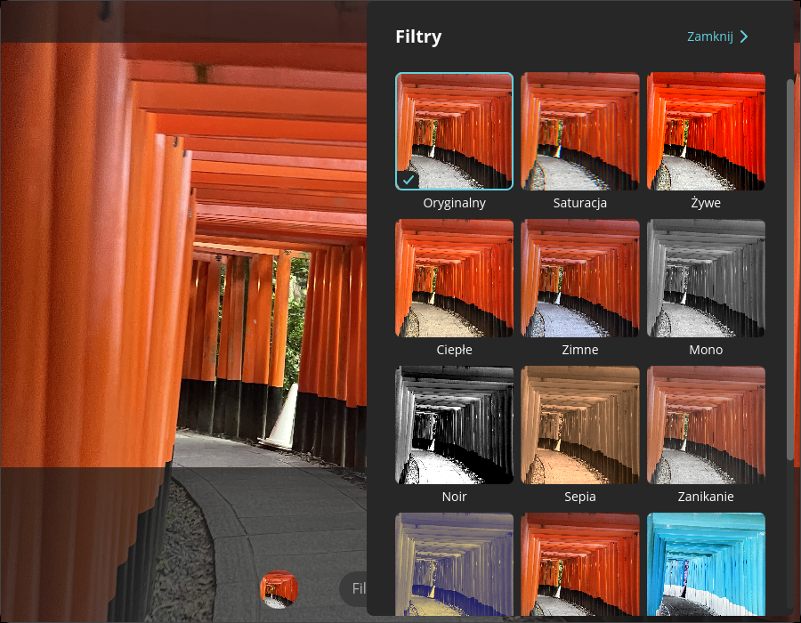
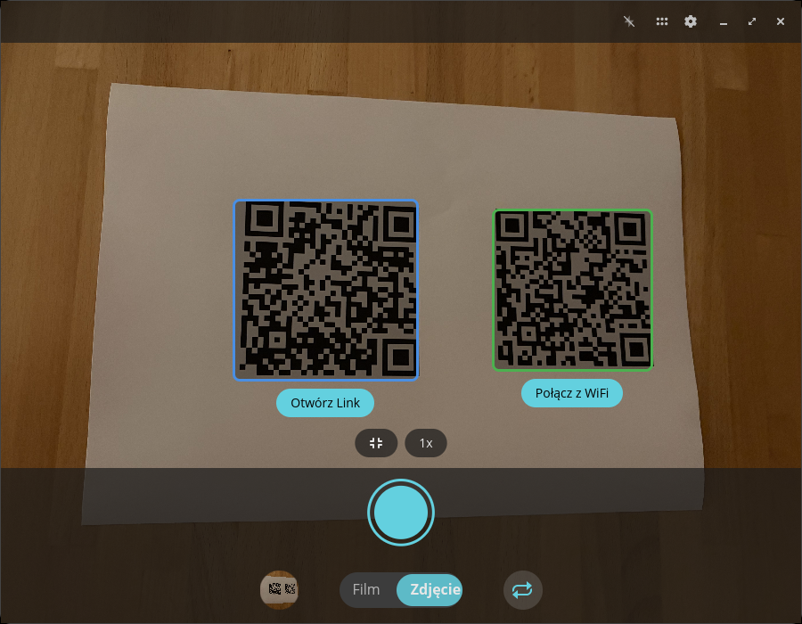
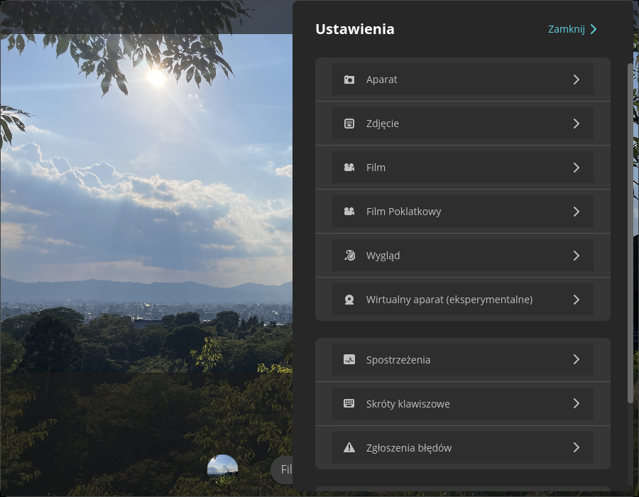

<!-- Generated by scripts/gen-metadata.py. Edit the captions in i18n/pl/camera.ftl and run `just generate`. -->

# Aparat (pl)

*Uwieczniaj zdjęcia i filmy.*

|  |  |
| :---: | :---: |
|  **Tryb zdjęciowy z menu narzędziowym** |  **Tryb zdjęciowy na telefonie z Linuxem** |
|  **Wybór filtrów** |  **Trwa nagrywanie filmu** |
|  **Wykrywanie kodów QR** |  **Zaawansowane ustawienia** |

---

[All languages](../../README.md#languages) ·
[en screenshots, including every theme and overlay effect](../../README.md)
