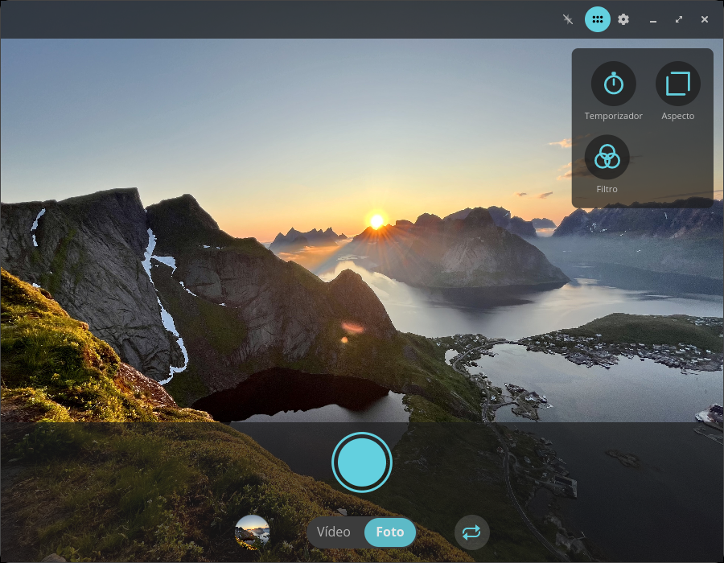
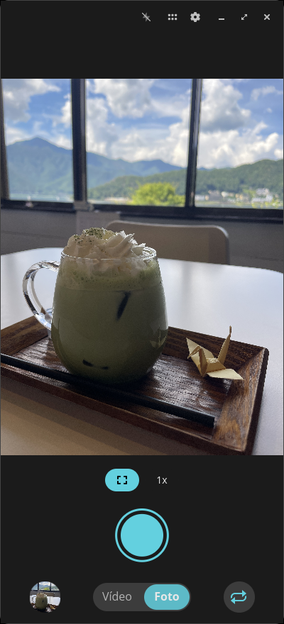
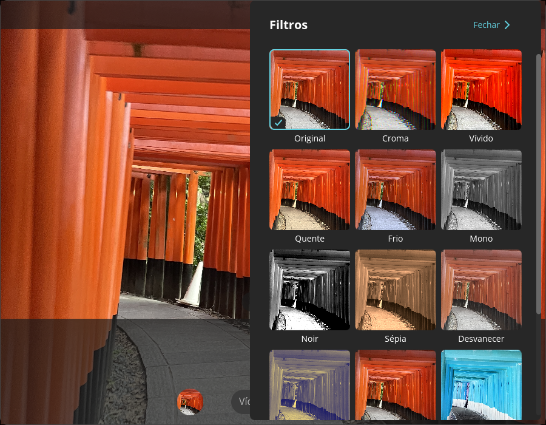
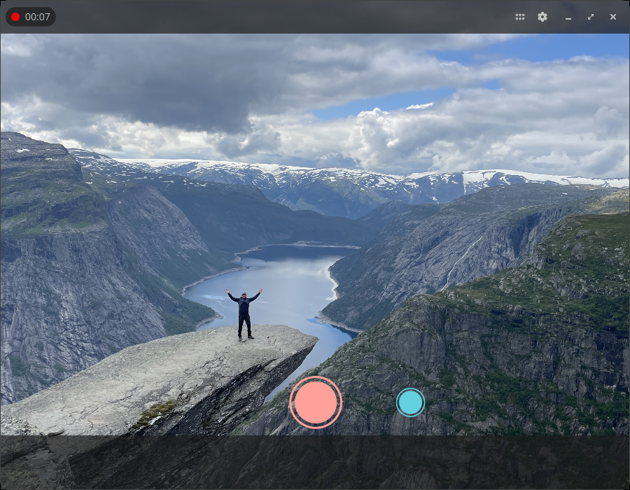
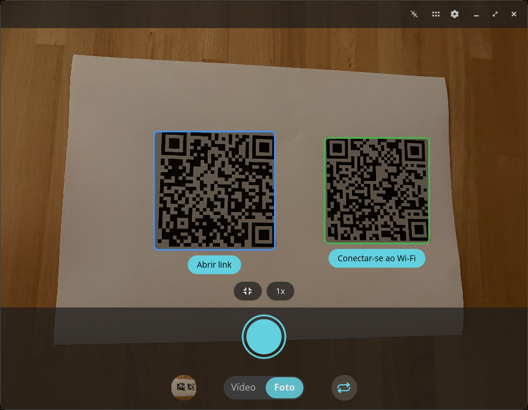
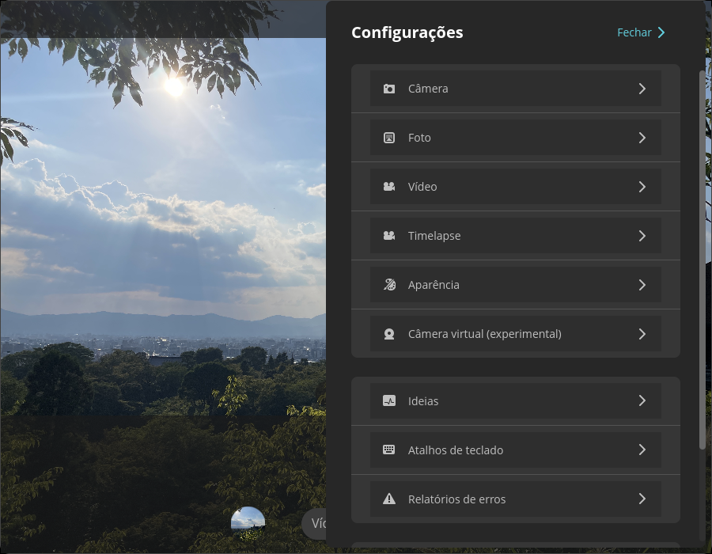

<!-- Generated by scripts/gen-metadata.py. Edit the captions in i18n/pt-BR/camera.ftl and run `just generate`. -->

# Câmera (pt-BR)

*Capture fotos e vídeos.*

|  |  |
| :---: | :---: |
|  **Modo foto com menu de ferramentas** |  **Modo foto em um telefone Linux** |
|  **Seletor de filtros** |  **Gravação de vídeo em andamento** |
|  **Detecção de código QR** |  **Configurações avançadas** |

---

[All languages](../../README.md#languages) ·
[en screenshots, including every theme and overlay effect](../../README.md)
