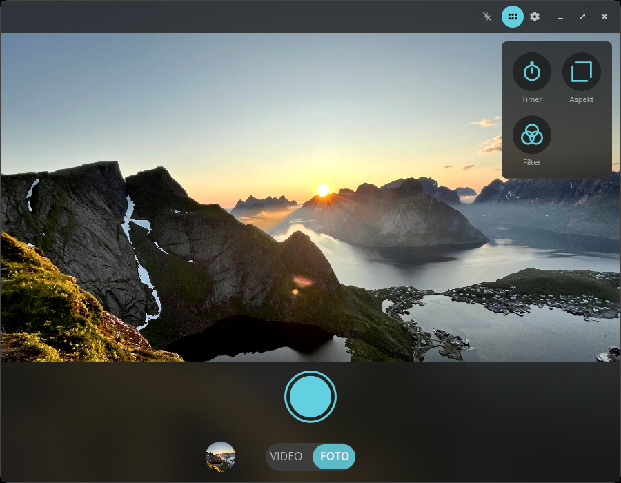
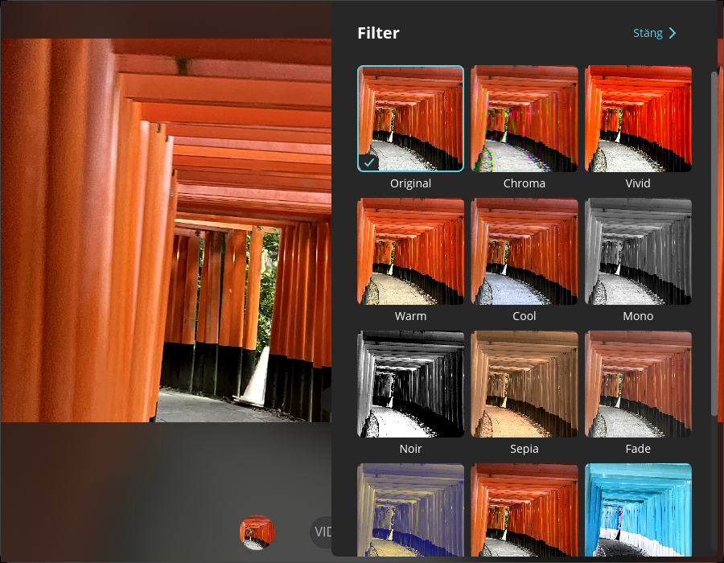
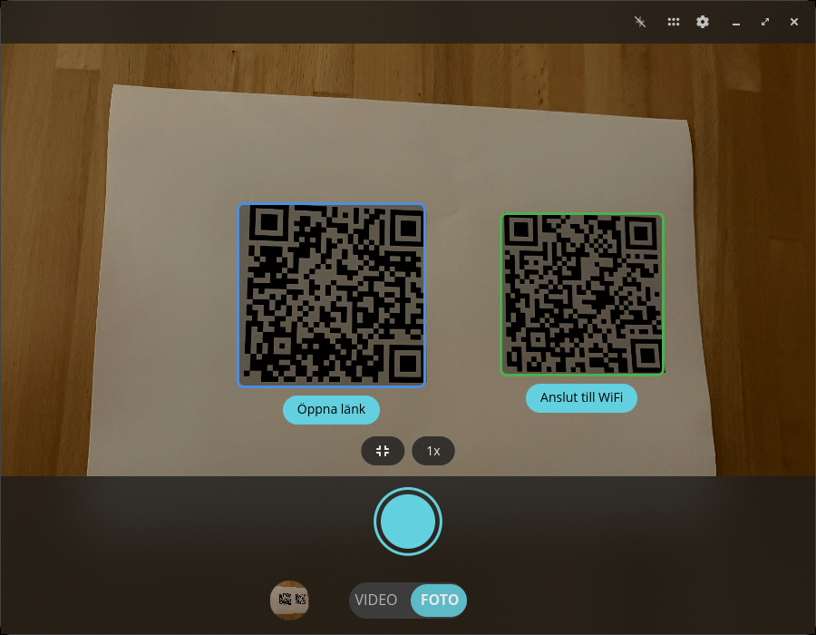
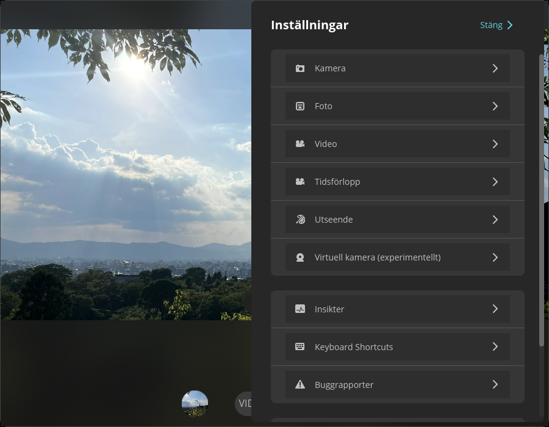

<!-- Generated by scripts/gen-metadata.py. Edit the captions in i18n/sv/camera.ftl and run `just generate`. -->

# Kamera (sv)

*Ta foton och videor.*

|  |  |
| :---: | :---: |
|  **Fotoläge med verktygsmeny** |  **Fotoläge med en Linux telefon** |
|  **Filterväljare** |  **Videoinspelning pågår** |
|  **QR-kodidentifiering** |  **Avancerade inställningar** |

---

[All languages](../../README.md#languages) ·
[en screenshots, including every theme and overlay effect](../../README.md)
