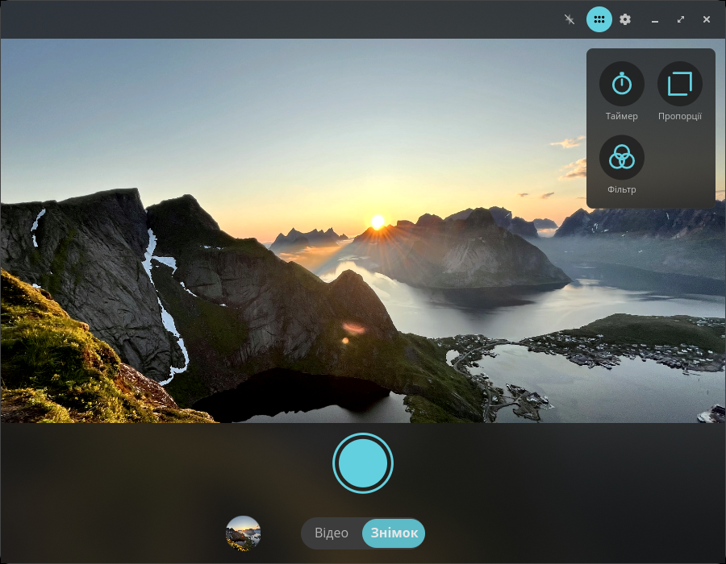
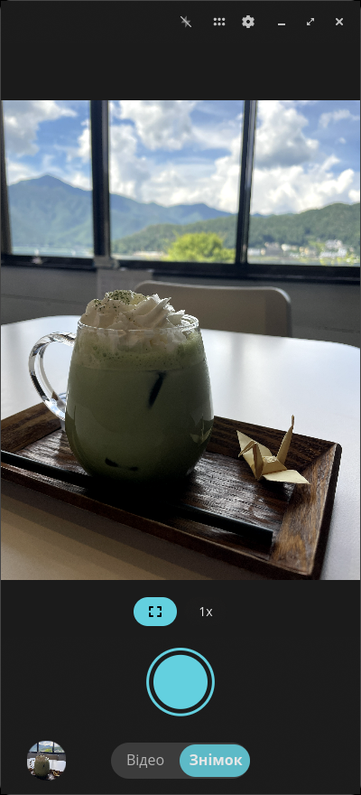
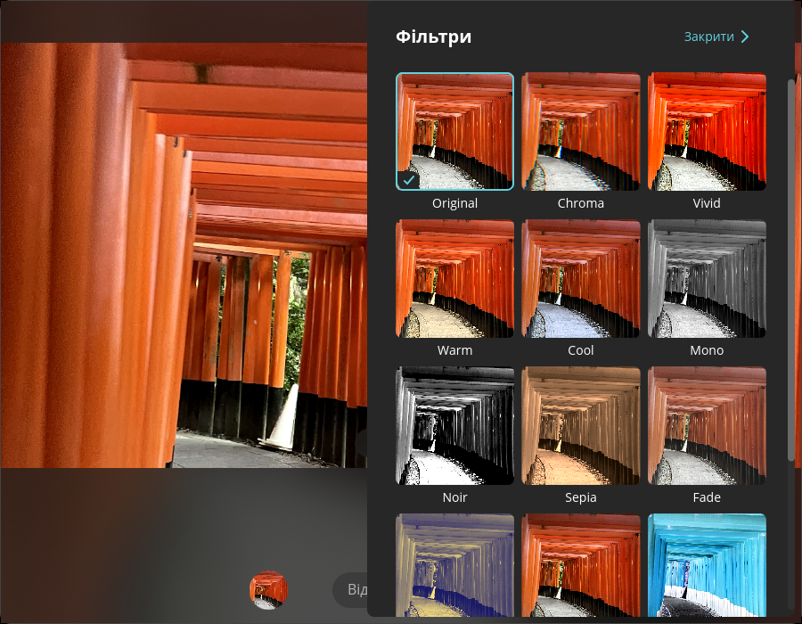
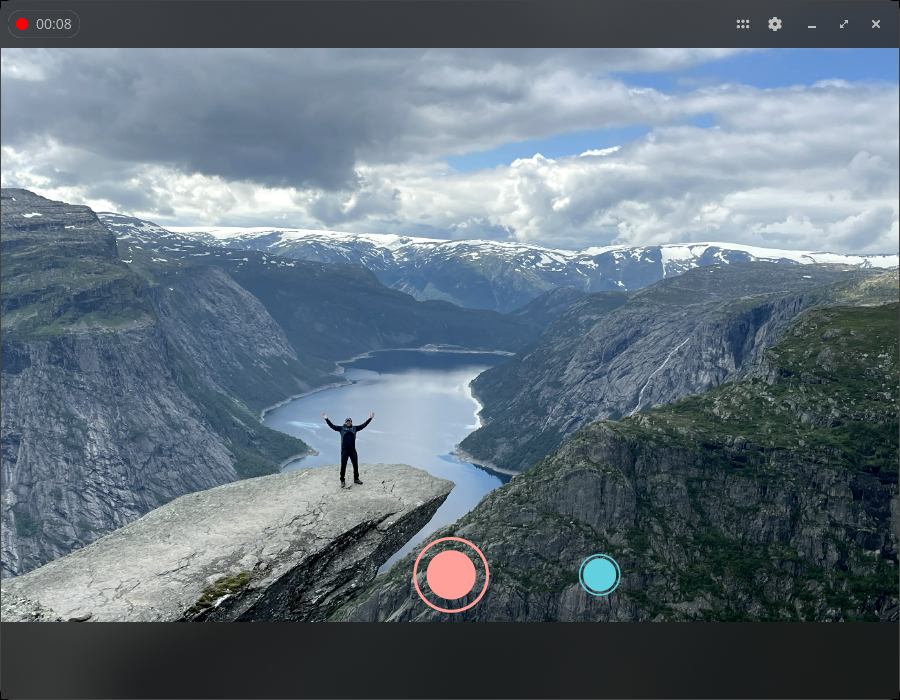
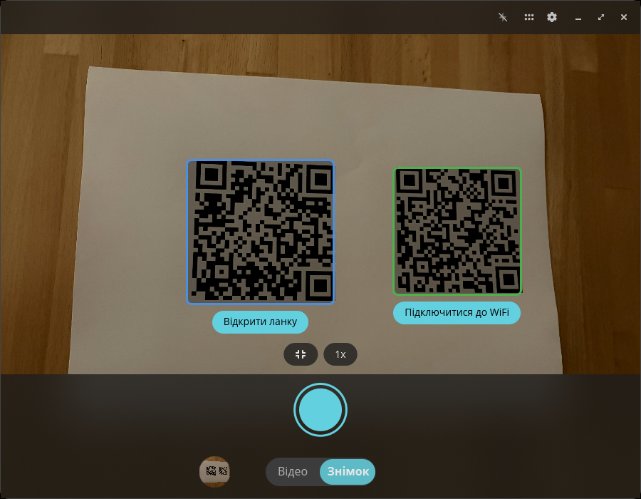
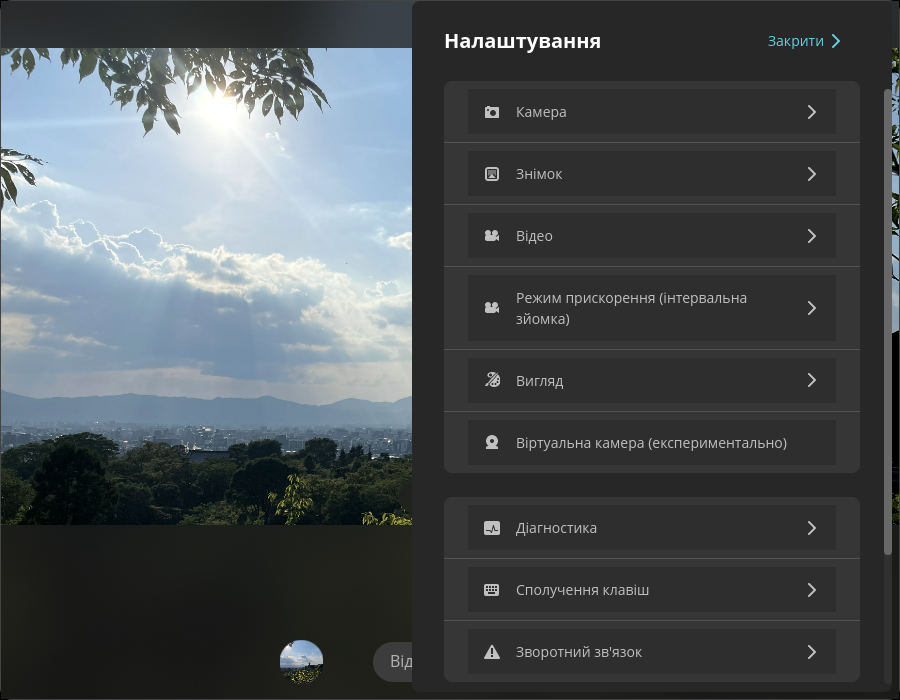

<!-- Generated by scripts/gen-metadata.py. Edit the captions in i18n/uk/camera.ftl and run `just generate`. -->

# Камера (uk)

*Знімайте фото та відео.*

|  |  |
| :---: | :---: |
|  **Photo mode with tools menu** |  **Photo mode on a Linux phone** |
|  **Вибір фільтрів** |  **Запис відео триває** |
|  **Виявлення QR-коду** |  **Розширені налаштування** |

> 2 of 6 captions are not translated into `uk` yet
> and are shown in English. Translations are welcome in
> [`i18n/uk/camera.ftl`](../../../i18n/uk/camera.ftl).

---

[All languages](../../README.md#languages) ·
[en screenshots, including every theme and overlay effect](../../README.md)
