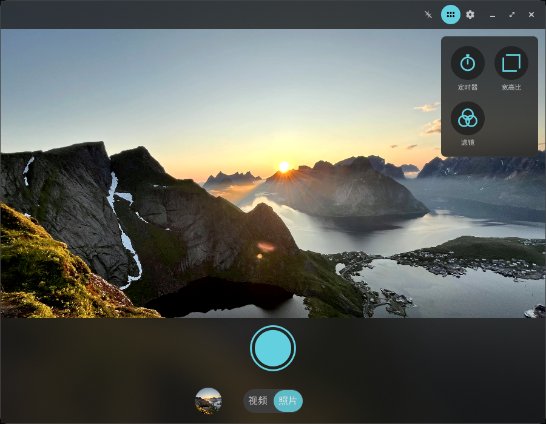
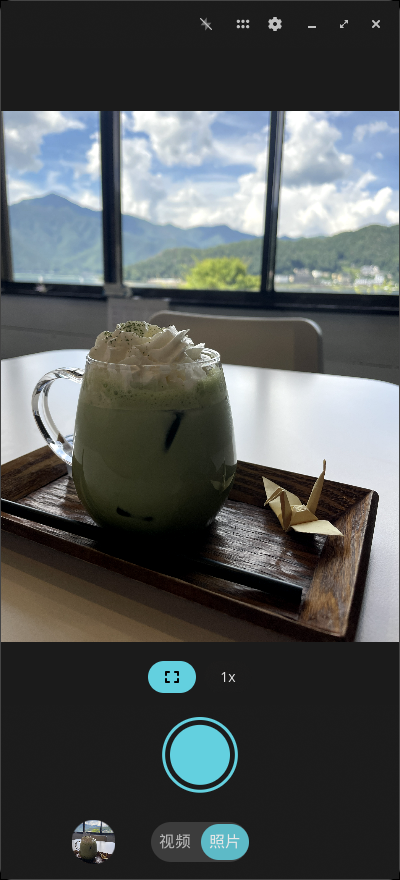
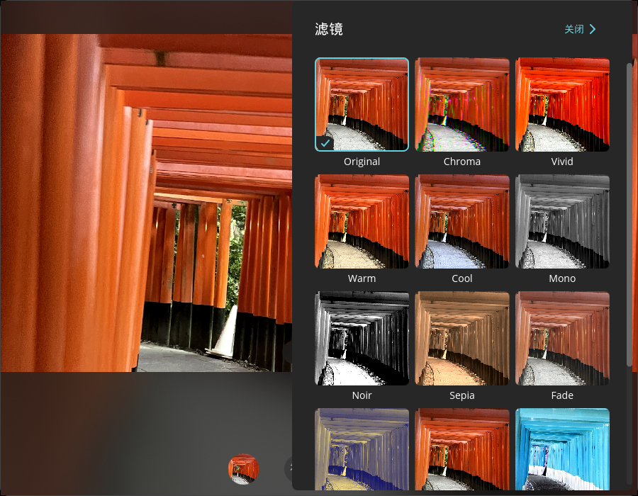
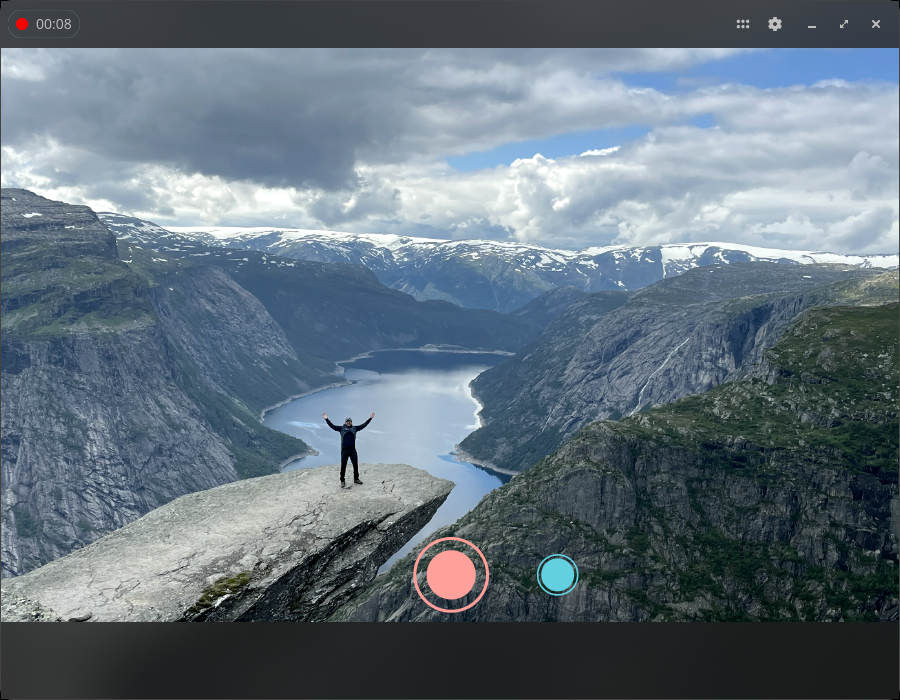
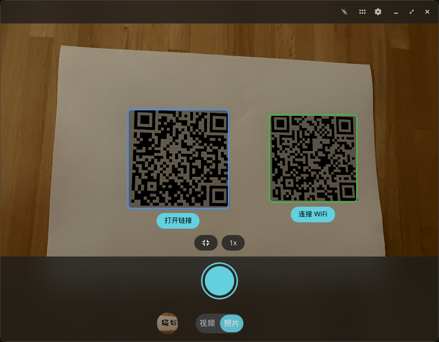
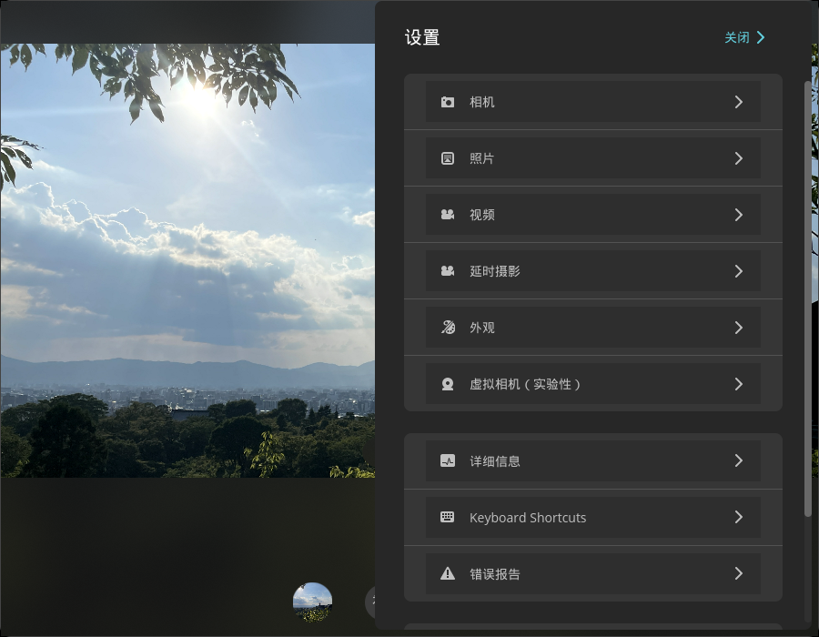

<!-- Generated by scripts/gen-metadata.py. Edit the captions in i18n/zh-CN/camera.ftl and run `just generate`. -->

# 相机 (zh-CN)

*拍摄照片和视频.*

|  |  |
| :---: | :---: |
|  **Photo mode with tools menu** |  **Photo mode on a Linux phone** |
|  **滤镜选择器** |  **视频录制中** |
|  **二维码检测** |  **高级设置** |

> 2 of 6 captions are not translated into `zh-CN` yet
> and are shown in English. Translations are welcome in
> [`i18n/zh-CN/camera.ftl`](../../../i18n/zh-CN/camera.ftl).

---

[All languages](../../README.md#languages) ·
[en screenshots, including every theme and overlay effect](../../README.md)
